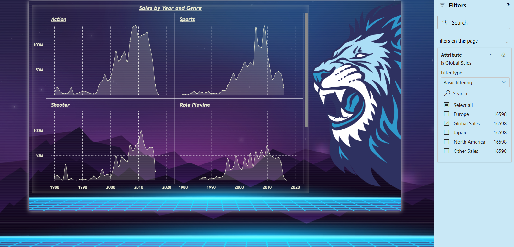

# AWS + Power BI Data Analysis (Amazon Athena + ODBC)

## Overview
This project focuses on building an end-to-end data analysis workflow using AWS services and Power BI to analyze video game sales across regions and genres.

## Tools & Technologies
- Amazon S3
- AWS Glue (Crawler & Data Catalog)
- Amazon Athena
- ODBC (Simba Athena Driver)
- Power BI Desktop 

## Project Workflow
- Uploaded dataset to Amazon S3 and used AWS Glue Crawler to create tables  
- Queried data using Amazon Athena and configured IAM roles & permissions  
- Connected Athena to Power BI via ODBC and imported additional local data  
- Cleaned, transformed, and combined datasets using Power Query  
- Built interactive dashboards and published to Power BI Service  

## Key KPIs
- Total Global Sales  
- Regional Sales (NA, EU, JP, Other)  
- Genre-wise Sales  
- Year-wise Trends  
- Top Genres  

## Dashboard Preview

## Key Learnings
- Learned AWS services integration (S3, Glue, Athena)  
- Built a cloud-based data pipeline  
- Handled real-world data and connection issues   
