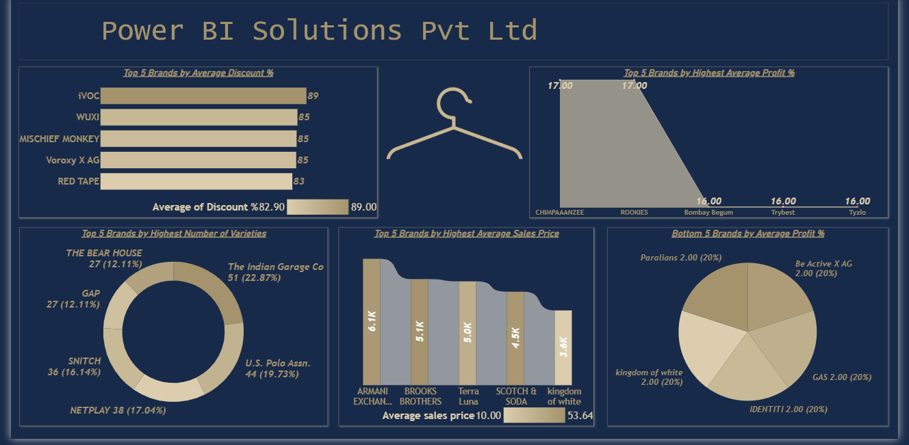

# Azure + Power BI Dashboard (Azure SQL Integration)

## Overview
This project demonstrates a simple end-to-end workflow using Azure SQL Database and Power BI. The goal is to store data in the cloud, perform basic data cleaning using SQL, and create an interactive dashboard for analysis.

---

## Tools 
- Microsoft Azure (Azure SQL Database)
- SQL Server Management Studio (SSMS)
- Power BI Desktop
- SQL

---

## Project Workflow
- Created Azure SQL Database and configured access
- Connected database to SSMS and imported CSV data
- Cleaned data using basic SQL queries
- Connected Power BI to Azure SQL and loaded data
- Built dashboard and published to Power BI Service

---

## Key KPIs
- Total Sales
- Discount %
- Profit %
- Cost Price

---

##  Dashboard Preview

---

## Key Learnings
- Basics of working with Azure SQL Database
- Data cleaning using SQL
- Connecting cloud database to Power BI
