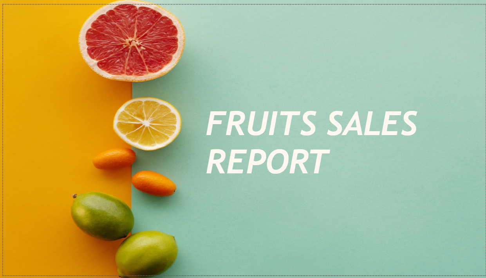
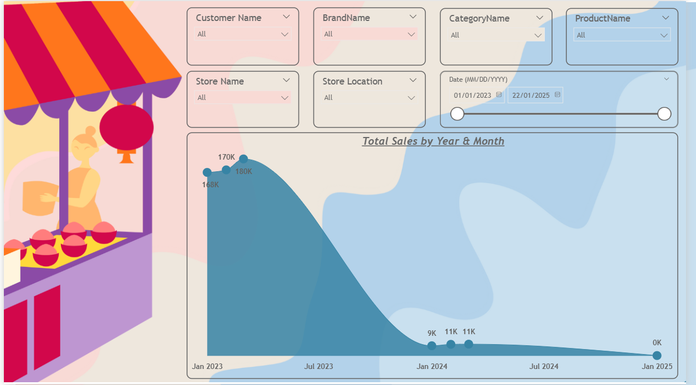
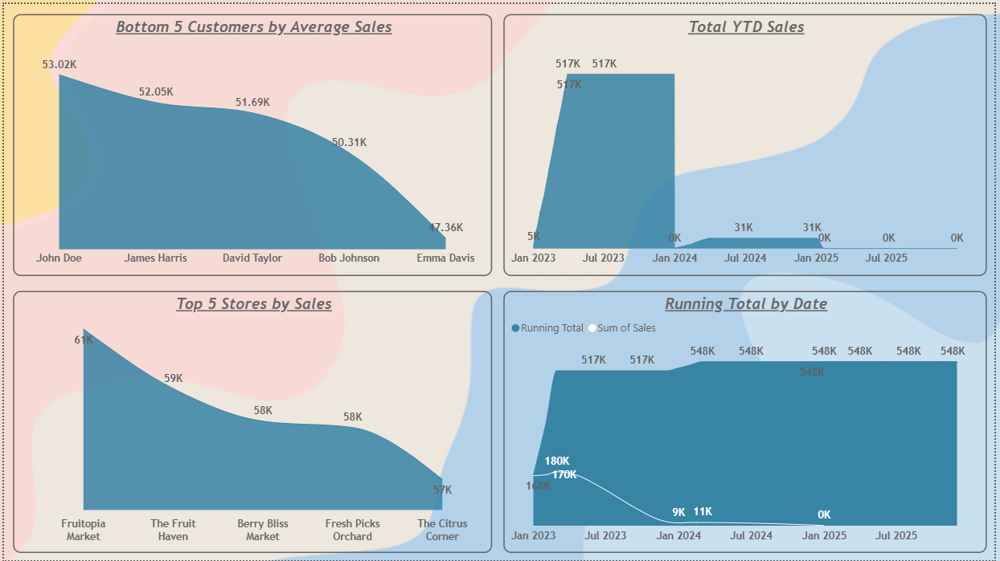

# Fruits Sales Dashboard

## Overview
This project focuses on analyzing sales performance using Power BI Service. The goal is to understand sales trends, customer performance, and store-level insights through interactive dashboards.

---

## Tools & Technologies
- Power BI Service
- Power BI Desktop

---

## Project Workflow
- Uploaded dataset to Power BI Service using local files 
- Created and managed relationships using Semantic Models
- Built interactive reports directly in Power BI Service
- Implemented bookmarks to switch between Total Sales and Average Sales views
- Applied filters and slicers to enable dynamic analysis across customers, stores, and dates
- Connected Power BI Desktop to Semantic Models for further reporting

---

## Key Insights
- Sales were higher in 2023 but dropped significantly in later periods
- A small number of stores contribute to the majority of total sales

---

## Dashboard Preview

