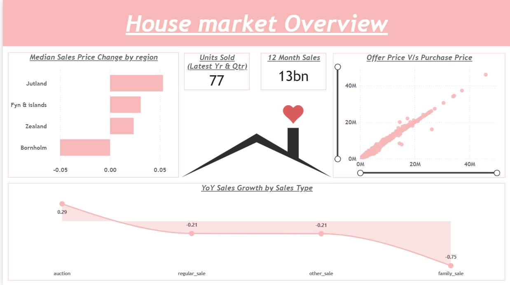
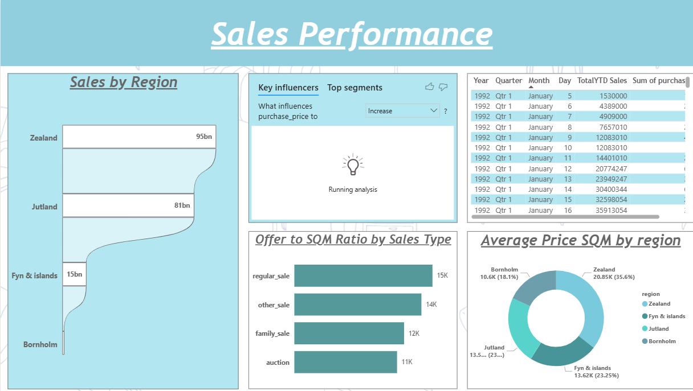
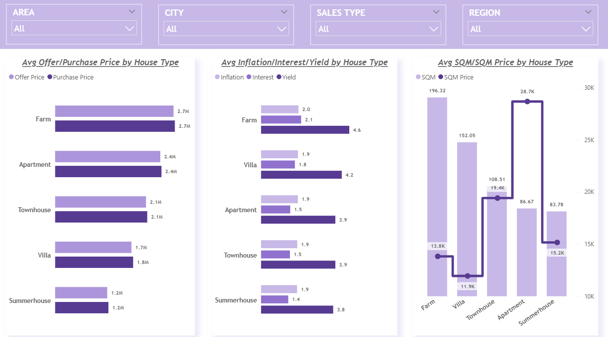

# Housing Data Analysis

## Overview
This project focuses on analyzing housing market data to understand trends in pricing, sales performance, and regional variations.

## Tools Used
- Google BigQuery
- Microsoft Power BI

## Key Features
- Processed housing dataset using BigQuery for scalable analysis
- Cleaned and transformed data to handle missing values and inconsistencies
- Created DAX measures such as YoY Sales Growth, Median Price Change, and Last 12 Month Sales
- Built interactive dashboards to analyze regional performance and pricing trends

## Dashboard Preview

