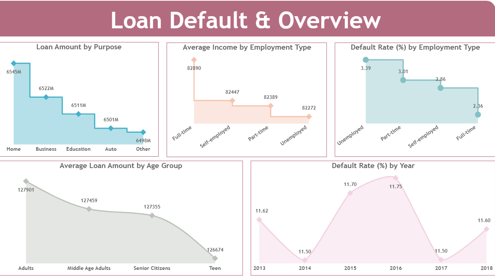
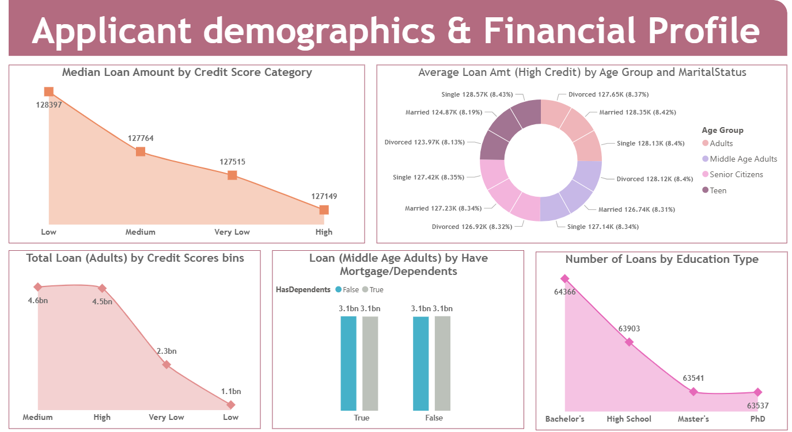
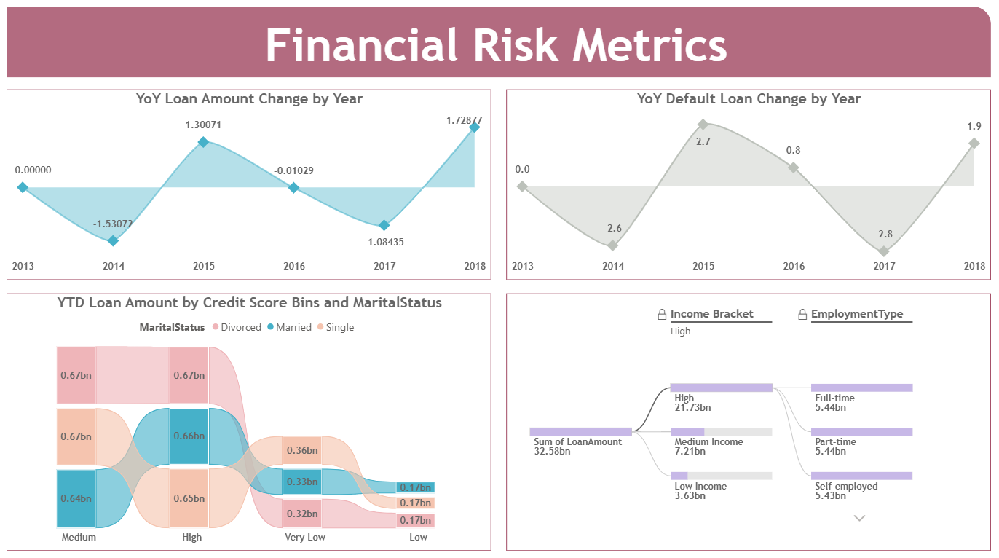

# Loan Default Data Analysis

## Overview
This project focuses on analyzing loan data to understand customer behavior, default patterns, and financial risk factors. The goal is to derive meaningful insights that can help in better decision-making for lending.

## Tools Used
- SQL Server
- Microsoft Power BI
- Power BI Dataflows

## Key Features
- Designed a data pipeline to integrate SQL Server data with Power BI Service
- Performed data transformation and cleaning for accurate analysis
- Created DAX measures to calculate KPIs such as default rate, loan distribution, and average income
- Built interactive dashboards to analyze applicant demographics, financial profile, and risk metrics
- Developed multi-page reports for detailed business insights

## Dashboard Preview

## Key Insights

- Higher loan default rates are observed among unemployed applicants compared to full-time employed individuals, indicating employment status as a key risk factor.

- Loan amounts are higher for people with medium and high credit scores, but people with low credit scores have a higher chance of defaulting.
